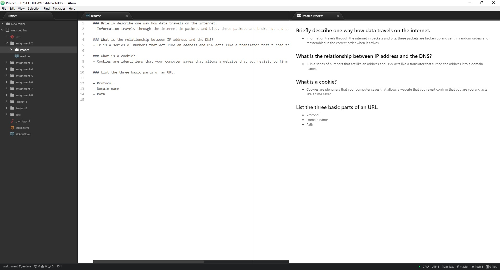

## Assignment 2

A Version Control System is a software that saves and track the changes to a file and folder. We use this system because it is easier for a user to get track of the history of a file and, this makes it possible to rebvert back to a prieviouse verson if there is any issues.

[This is my responses file](./responses.txt)

I learned more about the Internet Ip adresses and DSN. I nread what makes up URLs and the meaning. I created my second repository on GitHub. I was having issues getting my folder to show on GitHub but with a little trial and error was able to fix my issue.

