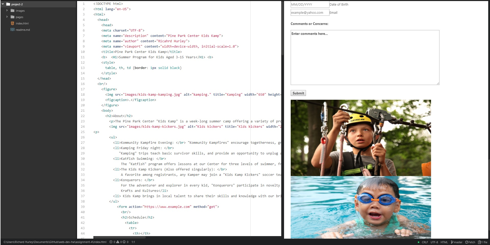

## Asignment 4

+ What is "alt text," and why do we use it?
 The alt text describes an image for the users who are visually impaired.

+ Describe any forms you've come across while browsing the web. What purposes do the serve?
The form types that I have read about this week. The most famous form is the plain text and the password one; they are used n order to login into websites the majority of the times. Additionally, the text area is used to leave comments on a website and the checkbox input is used to confirm the subscription to newsletters or to agree to terms and conditions.

+ During this week I read all the website's information. I was able to learn
how to optimize an image and how to use the ´´ element. I created a table.
I downloaded the assignment material.

+ Summarize your work cycle for this assignment. Review this page if you need some ideas.
During this week I didn't have any problem.

