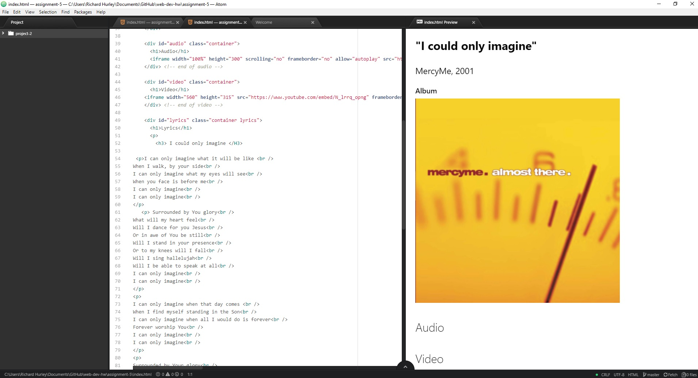

## Asignment 5

+ Briefly describe the difference between divs, classes, ids, and spans.

The `
` is used to organize websites by blocking base structures. The `<id>` element is unique and
can not me used again. The `<class>` attribute can be used many times and one element can have several `<class>` values.

+  Why might I consider third-party over self-hosted media?

Third party media has a high quality display and reduces the chance of incompatibility

+ During this week I didn't have any problem.

