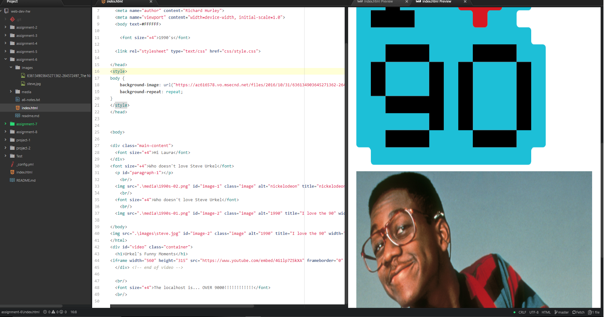

## Assignment 6

+ For this assignment I choose the 90s and the 1990s. It took me back a bit when i was a kid. i enjoyed this assignment.

+ I choose a bright palette because was total 90's and it reminded me of nickelodeon.

+ During this week I read the text and our website. I learned how to apply CSS and linking it to HTML. I learned how to apply a background to my website. I learned the importance that color has on a website.

