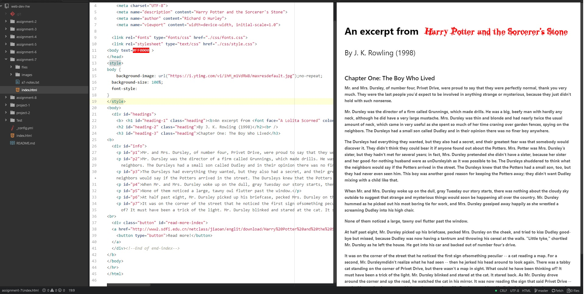

## Assignment 7

+ For this assignment I choose red font to stand out from the background and added a Harry Potter font to add that special touch.

+ The System Fonts are already installed on my system and Web Fonts are hosted on the server. The Web-safe Fonts that are installed on the operating system. I had do download the Harry Potter font.

+ During this week I read the textbook and website. I had alot of fun gathering the fonts and making this Harry Potter site. I learned how the fonts are important to the look and feel of a website.

