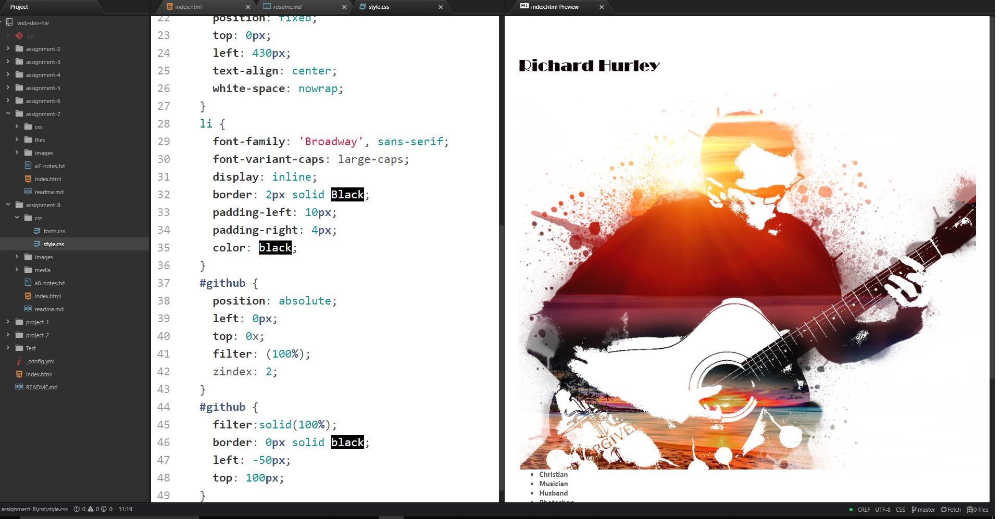

## Assignment 8

+ What is the difference between padding, margin, and borders? 
  1. Padding-The is a transparent space around the content.
 + margin-The area around the border.
 + borders-This is a fram around the content and padding.

+ What was the hardest task for you to accomplish this assignment? For example, was it overlapping  elements, working with sizing, creating layout, or something else entirely?
  + Honestly for some reason my computer crashed a few times while working on this project.  
  I’m not sure why. I was having an issue with my name showing up, but I was looking at  everything else other than the most obvious...the font was white on a white background.

+ Summarize your work cycle for this assignment. Review this page if you need some ideas.
 + During this week I read the textbook and website. I was happy to be able to add   a photoshop picture I made. I began with the simple HTML layout and began to   build from there. after adding my style.css the hard part was over. I spent a  more   time tweeking the layout than setting it up. I had alot of fun with this assignment.

 

