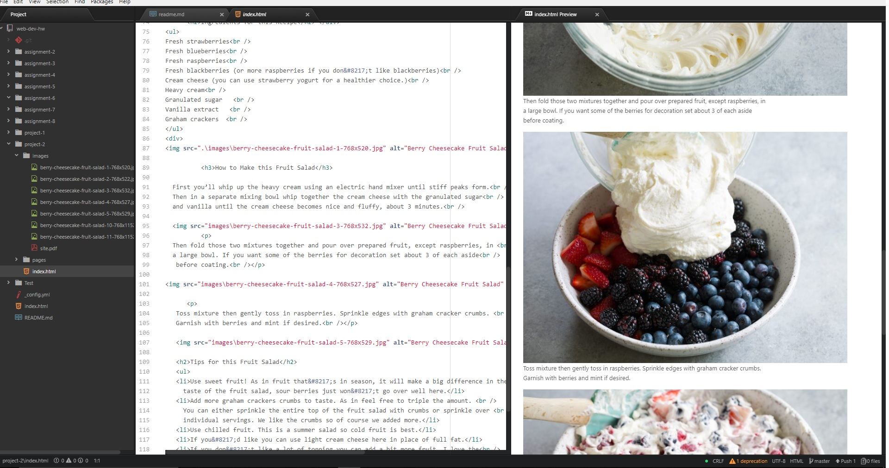

## Project 2

+ I enjoyed learning HTML for the first time. I found that my biggest issues were properly locating my files. The use of / vs. \ confused me at first. It’s amazing to find out that all these symbols that seemed like there’s no reason for have a significant use.

+ I am hoping I do well with CSS. At this point I would love a computer with 3 monitors to help me work in an organized matter.

+ My work cycle was long and I drank way too much coffee. As i said above i confused my / and \ so I spent way too long trying to figure out why my website links didnt work. I read our text and website text as well.

+ My issue this week was linking my websites properly. 

